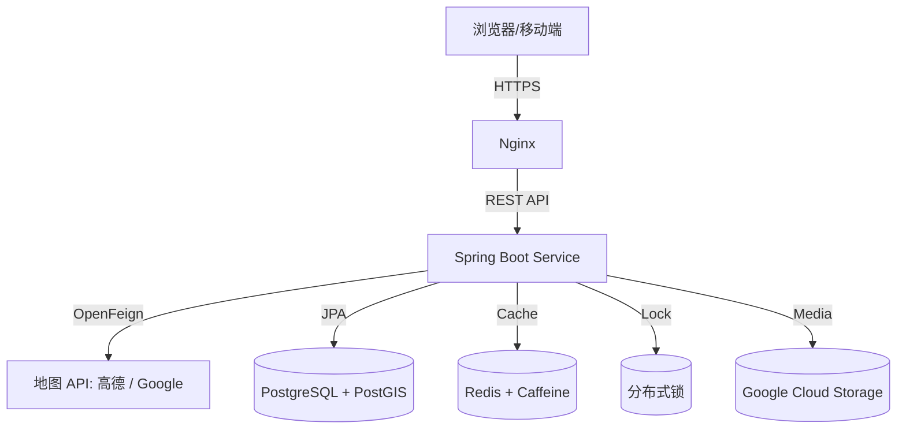

# 🏡 Staybooking - 在线短租预订平台 Wiki

## 📖 项目概述

Staybooking 是一个基于 **Spring Boot** 开发的现代化在线短租预订平台，类似于 Airbnb 的功能。该平台支持房东发布房源、租户浏览搜索并完成在线预订。项目采用微服务架构思想，通过多级缓存、分布式锁和云服务集成，实现了高并发场景下的安全性与性能保障。

### 🎯 核心功能

- **房源管理**：房东可发布、修改和删除房源信息
- **在线预订**：租户可浏览房源、搜索并完成预订
- **用户认证**：基于 JWT 的身份验证系统
- **地理位置服务**：基于 PostGIS 的空间索引和地理位置搜索
- **智能推荐**：基于用户历史和位置的房源推荐
- **高并发处理**：Redisson 分布式锁防止超卖
- **多级缓存**：Redis + Caffeine 提升性能
- **云端存储**：Google Cloud Storage 图片管理

## 🏗️ 系统架构



## 🛠️ 技术栈

### 后端框架

- **Spring Boot** - 应用主框架
- **Spring Security** - 安全认证框架
- **Spring Cloud OpenFeign** - 外部 API 调用
- **Spring Data JPA** - 数据访问层

### 数据库与存储

- **PostgreSQL** - 主数据库
- **PostGIS** - 地理空间数据扩展
- **Redis** - 分布式缓存
- **Caffeine** - 本地缓存
- **Google Cloud Storage** - 文件存储

### 并发与安全

- **Redisson** - 分布式锁
- **JWT** - 身份验证令牌
- **HTTPS/SSL** - 传输加密

### 部署与运维

- **Docker** - 容器化
- **Nginx** - 反向代理
- **Google Cloud Run** - 云端部署
- **Gradle** - 构建工具

## 📁 项目结构

```
src/main/java/com/laioffer/staybooking/
├── config/                  # 配置类
│   └── RedissonConfig.java
├── controller/              # 控制器层
│   ├── AuthenticationController.java
│   ├── BookingController.java
│   ├── HotController.java
│   └── ListingController.java
├── exception/               # 自定义异常
├── geography/               # 地理位置服务
│   ├── AmapClient.java
│   ├── AmapGeocodingService.java
│   ├── GeocodingStrategy.java
│   └── GoogleGeocodingService.java
├── model/                   # 数据模型
│   ├── dto/                 # 数据传输对象
│   ├── entity/              # 实体类
│   ├── request/             # 请求对象
│   └── response/            # 响应对象
├── repository/              # 数据访问层
├── security/                # 安全相关
│   ├── JwtAuthenticationFilter.java
│   ├── JwtHandler.java
│   ├── StaybookingCorsFilter.java
│   └── UserDetailsServiceImpl.java
├── service/                 # 业务逻辑层
└── StaybookingApplication.java
```

## 🔐 安全架构

### JWT 认证流程

1. 用户登录时提供用户名和密码
2. 服务器验证凭据，生成 JWT 令牌
3. 客户端在后续请求中携带 JWT
4. 服务器验证 JWT 并提取用户信息

### 安全特性

- **密码加密**：BCrypt 哈希算法
- **CORS 配置**：跨域请求控制
- **JWT 过期**：24 小时令牌有效期
- **角色权限**：房东/租户角色分离

## 🗃️ 数据库设计

### 核心表结构

#### users 表

- `id` - 用户唯一标识
- `username` - 用户名
- `password` - 加密密码
- `role` - 用户角色（HOST/GUEST）

#### listings 表

- `id` - 房源唯一标识
- `host_id` - 房东 ID
- `name` - 房源名称
- `address` - 房源地址
- `description` - 房源描述
- `guest_number` - 可容纳人数
- `image_urls` - 图片 URL 列表
- `location` - 地理位置坐标（PostGIS Point）

#### bookings 表

- `id` - 预订唯一标识
- `guest_id` - 租户 ID
- `listing_id` - 房源 ID
- `checkin_date` - 入住日期
- `checkout_date` - 退房日期

#### hots 表

- `id` - 热门地点标识
- `name` - 地点名称
- `district_code` - 区域代码
- `address` - 详细地址

## 🌍 地理位置服务

### 策略模式设计

项目采用策略模式支持多种地图服务：

```java
public interface GeocodingStrategy {
    GeoPoint getGeoPoint(String address);
}
```

### 支持的地图服务

- **高德地图 API**：国内地址解析
- **Google Maps API**：国际地址解析

### 配置切换

```yaml
staybooking:
  geocoding:
    provider: amap # 可选：google / amap
    google-key: ${GOOGLE_API_KEY}
    amap-key: ${AMAP_API_KEY}
```

## 🚀 API 接口文档

### 认证接口

#### 用户注册

```http
POST /auth/register
Content-Type: application/json

{
  "username": "user@example.com",
  "password": "password123",
  "role": "HOST"
}
```

#### 用户登录

```http
POST /auth/login
Content-Type: application/json

{
  "username": "user@example.com",
  "password": "password123"
}

Response:
{
  "token": "eyJhbGciOiJIUzI1NiIsInR5cCI6IkpXVCJ9..."
}
```

### 房源管理接口

#### 获取房东的房源

```http
GET /listings
Authorization: Bearer <JWT_TOKEN>
```

#### 创建新房源

```http
POST /listings
Authorization: Bearer <JWT_TOKEN>
Content-Type: multipart/form-data

name: 舒适公寓
address: 北京市朝阳区三里屯
description: 位于市中心的现代化公寓
guest_number: 4
images: [file1.jpg, file2.jpg]
```

#### 搜索房源

```http
GET /listings/search?lat=39.9042&lon=116.4074&checkin_date=2024-01-01&checkout_date=2024-01-03&guest_number=2&distance=5000
```

#### 删除房源

```http
DELETE /listings/{listingId}
Authorization: Bearer <JWT_TOKEN>
```

### 预订管理接口

#### 获取用户预订

```http
GET /bookings
Authorization: Bearer <JWT_TOKEN>
```

#### 创建预订

```http
POST /bookings
Authorization: Bearer <JWT_TOKEN>
Content-Type: application/json

{
  "listingId": 1,
  "checkInDate": "2024-01-01",
  "checkOutDate": "2024-01-03"
}
```

#### 删除预订

```http
DELETE /bookings/{bookingId}
Authorization: Bearer <JWT_TOKEN>
```

### 房源预订查询

```http
GET /listings/{listingId}/bookings
Authorization: Bearer <JWT_TOKEN>
```

## ⚡ 性能优化

### 缓存策略

1. **Redis 分布式缓存**

   - 用户会话信息
   - 热门房源数据
   - 地理位置查询结果

2. **Caffeine 本地缓存**
   - 频繁访问的配置信息
   - 静态数据缓存

### 分布式锁

使用 Redisson 实现分布式锁，防止：

- 房源重复预订
- 并发创建冲突
- 数据一致性问题

### 数据库优化

- **PostGIS 空间索引**：地理位置快速查询
- **JPA 查询优化**：减少 N+1 查询问题
- **连接池配置**：数据库连接复用

## 🐳 部署指南

### 本地开发环境

1. **启动数据库**

```bash
docker-compose up -d
```

2. **配置环境变量**

```yaml
spring:
  datasource:
    url: jdbc:postgresql://localhost:5432/postgres
    username: postgres
    password: secret
  data:
    redis:
      host: localhost
      port: 6379
```

3. **运行应用**

```bash
./gradlew bootRun
```

### 生产环境部署

1. **Docker 构建**

```bash
docker build -t staybooking .
```

2. **Google Cloud Run 部署**

```bash
gcloud run deploy staybooking --image gcr.io/project-id/staybooking
```

3. **环境变量配置**

- `DATABASE_URL`
- `DATABASE_USERNAME`
- `DATABASE_PASSWORD`
- `REDIS_HOST`
- `GOOGLE_CLOUD_STORAGE_BUCKET`

## 🧪 测试策略

### 单元测试

- Service 层业务逻辑测试
- Repository 层数据访问测试
- Controller 层接口测试

### 集成测试

- 数据库集成测试
- Redis 缓存测试
- 外部 API 调用测试

### 性能测试

- 并发预订压力测试
- 地理位置搜索性能测试
- 缓存命中率测试

## 🔧 配置说明

### application.yml 详解

```yaml
# 文件上传配置
spring:
  servlet:
    multipart:
      max-file-size: 10MB

  # 数据库配置
  datasource:
    url: jdbc:postgresql://${DATABASE_URL:localhost}:${DATABASE_PORT:5432}/postgres
    username: ${DATABASE_USERNAME:postgres}
    password: ${DATABASE_PASSWORD:secret}

  # JPA 配置
  jpa:
    hibernate:
      ddl-auto: update
    database-platform: org.hibernate.spatial.dialect.postgis.PostgisDialect

  # Redis 配置
  data:
    redis:
      host: ${REDIS_HOST:localhost}
      port: ${REDIS_PORT:6379}

# 业务配置
staybooking:
  gcs:
    bucket: staybooking-bucket-name
  geocoding:
    provider: amap
    amap-key: your-amap-key
  jwt:
    secret-key: your-jwt-secret-key
```

## 🚨 异常处理

### 自定义异常类

- `UserAlreadyExistException` - 用户已存在
- `InvalidBookingException` - 无效预订
- `DeleteListingNotAllowedException` - 房源删除限制
- `GeocodingException` - 地址解析失败
- `InvalidAddressException` - 无效地址

### 全局异常处理

通过 `@ControllerAdvice` 实现统一异常处理：

```java
@ControllerAdvice
public class GlobalControllerExceptionHandler {
    @ExceptionHandler(UserAlreadyExistException.class)
    public ResponseEntity<ErrorResponse> handleUserAlreadyExist(Exception e) {
        return ResponseEntity.badRequest()
            .body(new ErrorResponse(e.getMessage()));
    }
}
```

## 📊 监控与日志

### 日志配置

- 使用 SLF4J + Logback
- 分级别日志记录
- 关键操作审计日志

### 性能监控

- JVM 指标监控
- 数据库连接池监控
- Redis 连接监控
- API 响应时间统计

## 🔮 扩展功能

### 已规划功能

- [ ] 实时消息通知
- [ ] 支付系统集成
- [ ] 用户评价系统
- [ ] 房源推荐算法优化
- [ ] 移动端 APP 支持

### 技术改进

- [ ] 引入服务网格
- [ ] 实现读写分离
- [ ] 添加数据库分片
- [ ] 引入消息队列
- [ ] 实现分布式事务

## 🤝 贡献指南

### 开发规范

1. 遵循 Java 编码规范
2. 编写单元测试
3. 添加必要的注释
4. 提交前进行代码审查

### 提交流程

1. Fork 项目
2. 创建功能分支
3. 提交变更
4. 创建 Pull Request

## 📞 联系方式

- 项目维护者：[项目团队]
- 问题反馈：通过 GitHub Issues
- 技术讨论：项目讨论区

---

_最后更新时间：2024-01-01_
